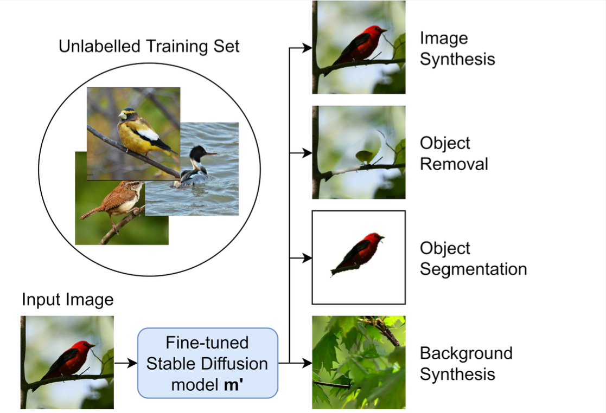
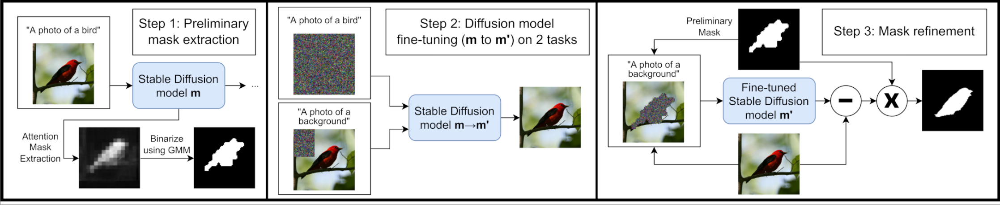

# Foreground-Background Separation through Concept Distillation from Generative Image Foundation Models

  

Source Code for Foreground-Background Separation through Concept Distillation from Generative Image Foundation Models accepted at ICCV2023

## Prerequesites 

You need a pretrained text to image diffusion model. We did our main experiments on [Stable diffusion v1.4](https://huggingface.co/CompVis/stable-diffusion-v1-4) but observed similar results with v1.3. 
Next install the required packages:

    pip install -r requirements.txt
    pip install -e ./stable-diffusion 

We resolve experiments with experiment config files located in _./experiments_. If you want to perform experiments on your own dataset you mainly have to change the following arguments: 

    base_dir = "PATH" # path to dataset
    out_dir = os.path.join(base_dir, "preliminary_masks/", "compute_preliminary_bird_masks") # where preliminary masks are stored
    rev_diff_steps = 40 # T in paper 
    num_repeat_each_diffusion_step = 1 # N in paper
    prompt = "a photo of a background"  
    goal_prompt = "bird" # object we want to detect, currently unused (defined explicitly when AttentionExtractor is set to relevant_token_step_mean)
    foreground_prompt = "a photo of a bird" 
    background_prompt = "a photo of a background"
    attention_extractor = AttentionExtractor("relevant_token_step_mean", tok_idx=5, steps=rev_diff_steps) # type of extraction methodextraction method

Expected layout: 
The dataloader expects the following structure: 

    basedir/
    ├── images.txt 
    ├── images/ 
    │   ├── 036.Northern_Flicker/Northern_Flicker_0124_28966.jpg         # Load and stress tests
    │   ├── ...
   
where images.txt is a list with the relative path and split numbers: 
    
    images/036.Northern_Flicker/Northern_Flicker_0124_28966.jpg 0
    images/066.Western_Gull/Western_Gull_0143_54909.jpg 0 
    ...
    

# Pipeline 

### Overview of our model pipeline

  

Key to our pipeline is the extraction of attention maps using text to image diffusion models. To do this we take the official 
repository of stable diffusion and change the implementation of attention to save the attention probabilities (see _src.stable-diffusion.ldm.modules.attention.CrossAttention.save_attention_)

### Step 1: Preliminary mask extraction
To save computation time we precompute the attention masks of the entire dataset into the folder defined by out_dir 

    python scripts/compute_attention_masks_raw.py experiments/birds/compute_preliminary_bird_masks_train.py

### Step 2: Finetune stable diffusion on your custom dataset
Now change the value of _data.params.train.params.opt_path to be equal to the output path from the previous steps and run the following command for finetuning the diffsion model

    python stable-diffusion/main.py -t --base ./experiments/configs/bird_finetuning.yaml --gpus 0,1 --scale_lr False --num_nodes 1  --check_val_every_n_epoch  1 --finetune_from ./stable-diffusion/sd-v1-4-full-ema.ckpt data.params.batch_size=4 lightning.trainer.accumulate_grad_batches=1 data.params.validation.params.n_gpus=2

*Sampling:* Now we can sample foreground and background using the prompt 'a photo of a background' or 'a photo of a bird'

*Optional:* Generate a synthetic foreground dataset and repeat step 1 and step 2  

### Step 3: 

The next step includes the preliminary masks but this time inpaints the foreground region with the background image. The difference image is then saved.

    python ./scripts/sample_background_prelim_masks.py experiments/birds/compute_preliminary_bird_masks_train.py # computes inpainted mask (Step 3)

### Segmentation Evaluation
To evaluate foreground segmentation we take the difference image from Step 3 as ground truth labels and train the model towards segmentation.

    python ./scripts/train_segmentation_refined.py experiments/birds/compute_preliminary_bird_masks_train.py

# For more details have a look at our paper 

    @InProceedings{Dombrowski_2023_ICCV,
        author    = {Dombrowski, Mischa and Reynaud, Hadrien and Baugh, Matthew and Kainz, Bernhard},
        title     = {Foreground-Background Separation through Concept Distillation from Generative Image Foundation Models},
        booktitle = {Proceedings of the IEEE/CVF International Conference on Computer Vision (ICCV)},
        month     = {October},
        year      = {2023},
        pages     = {988-998}
    }
